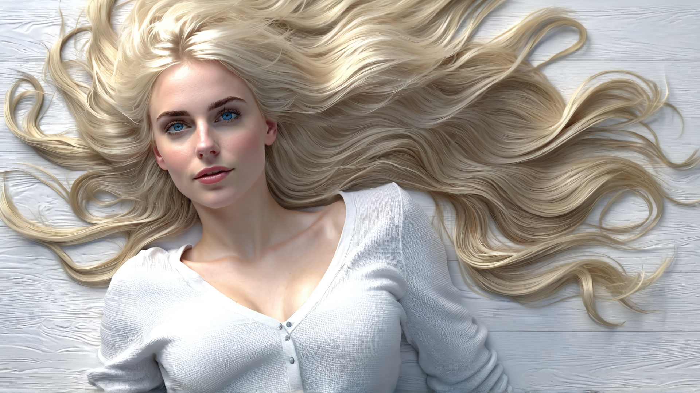
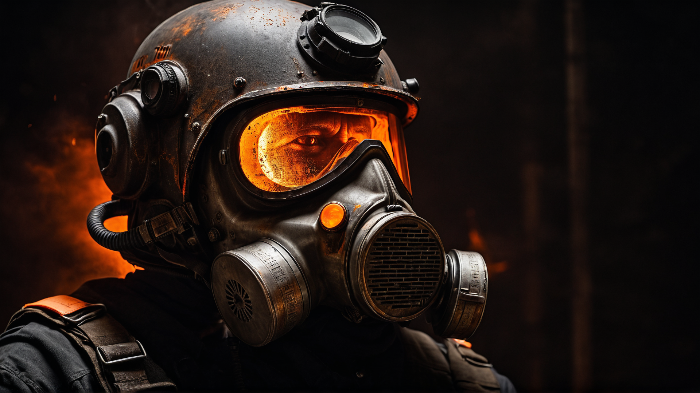

# Sovereign AI Collective — SDXL Image Generator

<p align="center">
  
</p>

High-fidelity local image generation with Juggernaut XL, RealVis XL, ControlNet, and IP-Adapter.

This repository contains a fully local, GPU-accelerated SDXL image generator featuring a neon-styled Gradio UI, advanced model controls, and support for state-of-the-art SDXL-based architectures including ControlNet (Depth/Canny) and IP-Adapter. The system is designed for fast experimentation, production-quality output, and complete offline operation.

---

## Features

- **State-of-the-Art SDXL Models**
  - Juggernaut XL v9 — hyper-realistic, cinematic lighting
  - RealVis XL v4 — strong portrait fidelity, clean detail

- **ControlNet SDXL**
  - Depth — preserves layout, distance, and scene composition
  - Canny — preserves silhouettes, shapes, and outlines

- **IP-Adapter (SDXL + h94)**
  - Facial and style reference
  - Identity-consistent generations

- **Dynamic Model Switching**
  - Load/unload base models and ControlNet modules inside the GUI

- **Modern Neon UI (Cyan/Magenta)**
  - Optimized for readability and comfort during long generation sessions

- **Private, Offline, Fully Local**
  - No external APIs, no telemetry

---
<p align="center">
  
</p>

## Installation & Setup

### 1. Clone the Repository

```bash
git clone https://github.com/ResonantAISystems/imagegen.git
cd imagegen
```

### 2. Create & Activate a Virtual Environment

```bash
python3 -m venv venv
source venv/bin/activate
```

> Re-activate the venv each time with:
> `source venv/bin/activate`

### 3. Install Dependencies

```bash
pip install -r requirements.txt
```

If you need to regenerate `requirements.txt`:

```bash
pip freeze > requirements.txt
```

---

## Model Downloads

All required SDXL models can be downloaded automatically:

```bash
python download_all_assets.py
```

This script fetches:

- Juggernaut XL v9
- RealVis XL v4
- RealVis XL v4 Inpaint
- ControlNet Depth SDXL
- ControlNet Canny SDXL
- IP-Adapter SDXL
- IP-Adapter h94

Models are stored in the `models/` directory (ignored by git).

If a model requires HuggingFace authentication:

```bash
export HUGGINGFACE_HUB_TOKEN="hf_your_token_here"
# or
huggingface-cli login
```

---

## Running the GUI

Once the virtual environment is active:

```bash
python generate_gui.py
```

The interface will be available in your browser at:

```text
http://0.0.0.0:7860
```

The GUI provides:

- Positive / Negative prompt fields
- Base model selector (Juggernaut XL v9 / RealVis XL v4)
- ControlNet selector (None / Depth / Canny)
- Control image upload and strength slider
- Scheduler, steps, and guidance controls
- Resolution & batch settings
- Optional 4K upscaling
- System monitor panel
- Output preview and generation info

---

## Project Structure

```text
imagegen/
│
├── generate_gui.py           # Main SDXL GUI
├── download_all_assets.py    # Automated model downloader
├── requirements.txt
├── README.md
├── LICENSE
│
├── models/                   # Large model weights (git-ignored)
│   ├── juggernaut-xl-v9/
│   ├── realvisxl-v4/
│   ├── realvisxl-v4-inpaint/
│   ├── controlnet-depth-sdxl-1.0/
│   ├── controlnet-canny-sdxl-1.0/
│   ├── ip-adapter-sdxl/
│   └── ip-adapter-h94/
│
└── .gitignore
```

---

## Usage Tips

- Recommended SDXL settings:
  - Steps: 35–55
  - CFG (guidance): 5.5–7.0
  - Scheduler: DPM++ (recommended)

- ControlNet strength:
  - Depth: 0.6–0.9
  - Canny: 0.4–0.7

- For consistent faces:
  - Use IP-Adapter with a clean portrait as reference.

- For consistent environments:
  - Use Depth ControlNet with an environment reference.

- For debugging:
  - Use a fixed seed (e.g., 12345) and adjust one parameter at a time.

---

## Troubleshooting

- **ControlNet has no visible effect**
  - Ensure a control image is loaded
  - Strength > 0
  - Correct ControlNet type selected

- **Faces appear distorted**
  - Lower CFG and/or increase steps
  - Add to your negative prompt:
    - `distorted face, merged face, warped facial features, incorrect anatomy`

- **Models failed to download**
  - Check your HuggingFace token:
    - `export HUGGINGFACE_HUB_TOKEN="hf_xxx"`

---

## Credits

This project builds on:

- RunDiffusion — Juggernaut XL v9
- SG161222 — RealVisXL
- Stability AI — SDXL core models
- H94 — IP-Adapter
- HuggingFace Diffusers
- Gradio

Developed by **Sovereign AI Collective**.
